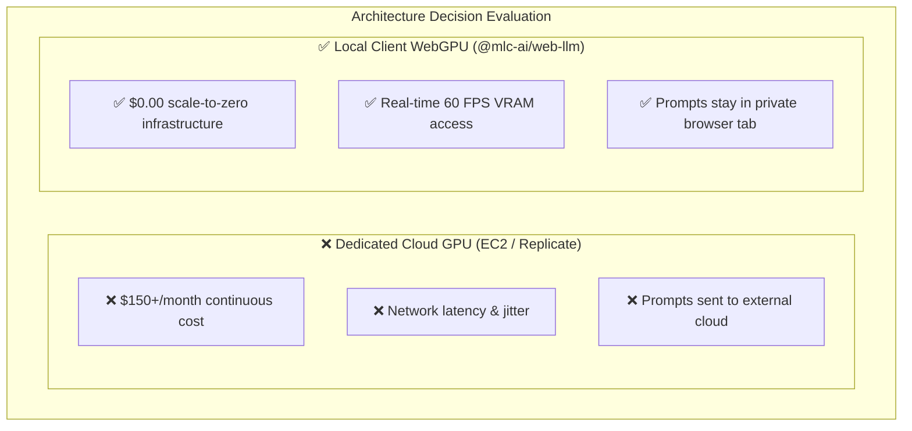

# ADR 0001: Edge-AI WebGPU Inference Architecture

## Status
Approved

## Context
Exposing Large Language Model (LLM) logits for real-time visualization requires executing transformer forward passes. The traditional approach of running a GPU-enabled backend server (e.g. AWS EC2 with NVIDIA T4/A10G, or hosted serverless APIs like Replicate) introduces significant complications:
1. **High Infrastructure Cost**: Dedicated GPU nodes run continuously and bill $150-$500/month even when idle.
2. **Network Latency & Jitter**: Fetching logits over the network on every token generation step introduces latency and ruins the 60 FPS slider responsiveness.
3. **Data Security**: Sending proprietary or private prompts to external third-party servers raises data privacy and compliance risks for enterprise customers.

## Decision
We decided to implement a **hybrid client-first execution model**:
- **Primary Engine**: Runs full model inference (SmolLM2, Qwen2.5) directly inside the user's browser using **WebGPU** via the `@mlc-ai/web-llm` framework, offloaded to a background WebWorker thread.
- **Fail-safe Engine**: Falls back to a stateless, CPU-based FastAPI server hosted on Google Cloud Run configured to scale to zero instances ($0.00 idle cost), which serves synthetic or cached logits when WebGPU is not supported by the client browser.

## Consequences
- **Pros (Benefits)**:
  - **Zero Idle Server Cost**: The infrastructure costs are $0.00 when the app is not in use, as Cloud Run scales to zero.
  - **Strong Privacy Assurances**: Prompts never leave the client's local memory space when using WebGPU.
  - **Fluid UI Performance**: Direct memory access to local logits permits 60 FPS visual rendering.
- **Cons (Tradeoffs)**:
  - **Client Capabilities**: Users must run WebGPU-supported browsers (Chrome 113+, Safari 18+) and have compatible graphics cards with at least 512MB VRAM.
  - **Model Download Overhead**: The first page load requires downloading model weights (e.g. 180MB for SmolLM2), which are cached locally thereafter.
