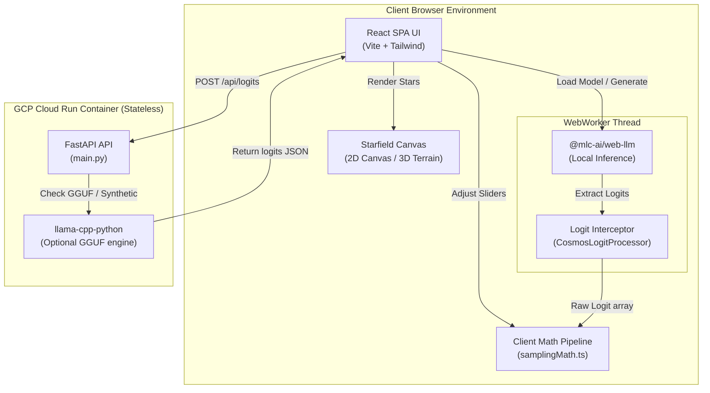

# System Architecture (How & Why It Works)

The Token Cosmos architecture is built on a **fully-decentralized client-first paradigm**. Rather than performing heavy matrix math and sampling filters on expensive backend GPUs, the mathematical transformation pipeline runs directly in the client's browser. This page details the components, data flows, and design rationale.

---

## 1. Architectural Blueprint & Data Flow

The Token Cosmos supports two execution paths:
1. **Local Edge Mode (WebGPU / WASM)**: Runs full model inference in browser memory, utilizing the client's local GPU.
2. **Cloud Run API Mode**: Interacts with the lightweight FastAPI container to retrieve logits (either simulated or computed via a local GGUF model running on the container's CPU).



---

## 2. Technical Stack & Rationale

| Technology | Purpose | Rationale |
| :--- | :--- | :--- |
| **React + TypeScript** | Core Application framework | Enables reactive, modular state management. Type safety ensures stable data structures when transferring raw buffers (like Float32Arrays) between the main thread and WebWorkers. |
| **HTML5 2D Canvas & WebGL** | Particle Starfield & Semantic Terrain | Rendering 150,000+ vocabulary tokens as individual stars at 60 FPS. Standard DOM elements would crash the browser, whereas canvas/WebGL handles massive coordinate sets efficiently. |
| **WebGPU (`@mlc-ai/web-llm`)** | Edge-AI Local Inference | Offloads model calculations directly to client-side GPU hardware. Eliminates server-side hosting costs and ensures user privacy. |
| **FastAPI (Python 3.11)** | Backend API and Static Hosting | A high-performance, asynchronous microservice that compiles and serves the React SPA alongside API endpoints, maintaining a single, unified Docker layer. |
| **llama-cpp-python** | CPU GGUF inference | Allows local developers or CPU environments to load small Qwen or Llama models via GGUF files without GPU requirements. |

---

## 3. Mathematical Pipeline (`samplingMath.ts`)

The client math pipeline runs in browser memory at 60 FPS, updating the visual probabilities instantly as users drag the parameter sliders.

### Step 1: Logit Bias & Penalties
We modify the raw logits $z_i$ received from the model based on user-defined biases and penalties:
$$z_i' = z_i + \text{bias}_i - (\text{presence\_penalty} \times p(x_i) + \text{frequency\_penalty} \times c(x_i))$$
- $\text{bias}_i$ is the Logit Bias added to token $i$.
- $p(x_i) \in \{0, 1\}$ indicates if token $i$ is present in the historical output.
- $c(x_i)$ is the frequency count of token $i$ in the output.

### Step 2: Temperature Scaling & Softmax
To convert scaled logits into probabilities, we use a **Numerically Stable Softmax** with the **Log-Sum-Exp Trick** to avoid overflow/underflow errors in JavaScript:
$$P(x_i) = \frac{\exp\left(\frac{z_i' - z_{\max}}{T}\right)}{\sum_j \exp\left(\frac{z_j' - z_{\max}}{T}\right)}$$
- $T$ is the Temperature parameter.
- $z_{\max} = \max_j(z_j')$ is subtracted from each logit to keep exponents $\le 0$.
- **Greedy Fallback**: If $T \le 0.01$, we bypass the softmax and set the highest logit token to $1.0$ (100%), setting all others to $0.0$.

### Step 3: Sampling Filters (Top-K, Top-P, Min-P)
We truncate the probability distribution to keep only high-likelihood tokens:
1. **Top-K**: Sort tokens by probability and discard any token ranked below index $K$.
2. **Top-P (Nucleus)**: Discard tokens beyond the cumulative probability threshold $P$.
3. **Min-P**: Filter out tokens whose probability is lower than $min\_p \times P_{\max}$. This is a superior alternative to Top-P because it scales dynamically based on the model's confidence.

---

## 4. Why Edge-AI (WebGPU) Over Cloud APIs?

Choosing WebGPU local execution instead of calling cloud endpoints (like OpenAI or Replicate) provides three massive structural advantages:

### 1. Zero Infrastructure Idle Costs ($0.00 Idle Cost Design)
If no one is using the application, Google Cloud Run scales the API container to zero instances. Because inference runs in the user's browser, there are no running VMs with idle GPUs billing the company.

### 2. Privacy by Design
Prompts, system prompts, and output text are processed entirely inside the client browser. No text is transmitted over the network when running in WebGPU mode, making the application 100% compliant with strict enterprise data privacy rules.

### 3. Infinite Scalability
Under traditional architectures, supporting 1,000 concurrent users running inference requires massive clusters of NVIDIA A100/H100 GPUs. With the WebGPU edge design, scaling to 100,000 users requires zero server scaling; each user provides their own computational hardware.

---

## 5. Token Streaming & Reasoning State Pipelines (v4.1)

In version 4.1, the application introduces a decoupled real-time streaming model to display token transitions at 60 FPS while isolating reasoning chains.

### Autoregressive Streaming Topology
1. **WebWorker Execution**: The MLCEngine generates tokens autoregressively. As each token index is predicted:
   - The logits are captured by the `CosmosLogitProcessor`.
   - The worker detokenizes the index and posts a `TOKEN_GENERATED` event alongside a `LOGITS_READY` payload containing the raw logit buffer.
2. **Main Thread Integration**: The main React thread intercepts these messages via the `useInferenceEngine` hook. Rather than wait for full sequence generation, the state appends the new text segment and recalculates coordinate projections instantly.
3. **Canvas Updates**: The 2D and 3D canvases capture the coordinate updates. Particle trails are recalculated and animated using web frame interpolations, preventing layout shifts or visual stutter during fast generation steps (>20 tokens/sec).

### Reasoning Model (`<think>`) Parsing
Reasoning-capable models structure their outputs by prefixing thinking sequences with `<think>` and concluding with `</think>`. The Token Cosmos handles this structural separation at the state layer:

```
                  REASONING STATE ROUTING
                  
             ┌─────────────────────────────────┐
             │    WebGPU Token Generation      │
             └─────────────────────────────────┘
                              |
                              v
             ┌─────────────────────────────────┐
             │   Worker checks <think> State   │
             └─────────────────────────────────┘
             /                                 \
      (Inside <think>)                  (Outside <think>)
             v                                 v
┌─────────────────────────┐       ┌─────────────────────────┐
│  - isThinking = True    │       │  - isThinking = False   │
│  - Route to Thought Log │       │  - Route to Output UI   │
│  - Render Dim Asteroids │       │  - Render Main Stars    │
└─────────────────────────┘       └─────────────────────────┘
```

- **State Flags**: The worker monitors token streams. Upon encountering `<think>`, it sets the `isThinking` flag to `true` in all subsequent `LogitSnapshot` payloads. It reverts the flag to `false` when `</think>` is detected.
- **Visual Separation**: 
  - *Thought Log Panel*: The frontend intercepts the `isThinking` packets and streams them into a separate collapsible text field, hiding them from the standard user generation box.
  - *Canvas Highlight Dimming*: The 3D canvas dims the main Supergiant star constellations and highlights the reasoning tokens as a faint outer cloud of asteroids, illustrating the cognitive density of the model's self-reflection process in real-time.

