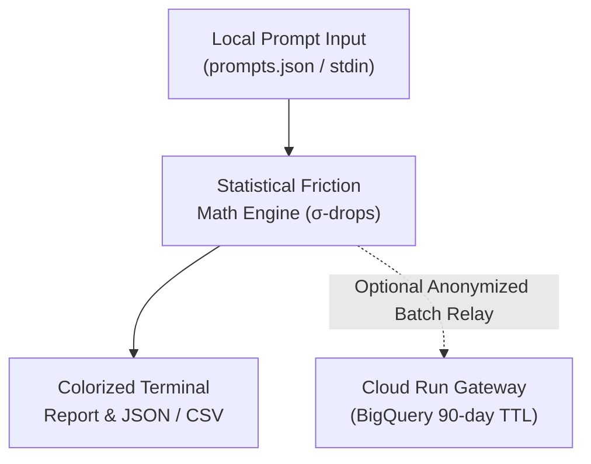

# cosmos-lint CLI User Guide

`cosmos-lint` is a zero-egress, local developer command-line utility that inspects prompt tokens, calculates probability drops, detects structural hallucination friction points, and recommends optimal sampling parameters before deploying prompts into production.

---

## 1. Overview & Architecture

`cosmos-lint` acts as an automated prompt linter for software engineering teams. It evaluates prompt candidates locally against mathematical sampling metrics without sending prompt text to third-party cloud APIs.



---

## 2. Execution Tiers & Performance Characteristics

`cosmos-lint` is engineered with distinct execution tiers to fit different development and CI/CD environments:

| Tier | Engine | Startup Latency | VRAM Required | Primary Use Case |
| :--- | :--- | :---: | :---: | :--- |
| **Statistical Linter** | Pure Mathematical Vector Engine | $< 50\text{ ms}$ | $0\text{ MB}$ | Fast pre-commit hooks, CI/CD prompt regression tests, and local parameter linting. |
| **Standalone Deno Binary** | Deno V8 / WebGPU Native Engine | Sub-second | $0-180\text{ MB}$ | Single-binary air-gapped terminal deployment (`deno compile --unstable-webgpu`). |
| **Neural Web Studio** | `@mlc-ai/web-llm` WebWorker | $1.5 - 3.0\text{ s}$ | $180 - 950\text{ MB}$ | Interactive 3D celestial starfield visualizer and real-time prompt steering. |

---

## 3. Installation & Quick Start

### Running with Node / TypeScript
```bash
# Navigate to the CLI package
cd cli/

# Build TypeScript executable
npm run build

# Run the instant benchmark linter
node dist/cosmos-lint.js --sample
```

### Compiling to a Standalone Deno Binary
```bash
# Navigate to the CLI package
cd cli/

# Compile single-file executable using native Deno WebGPU
deno task compile

# Execute standalone binary
./bin/cosmos-lint --sample
```


---

## 4. CLI Command Reference

### Summary Options

| Flag | Argument | Description | Example |
| :--- | :---: | :--- | :--- |
| `--sample` | None | Evaluates pre-packaged enterprise prompt benchmarks. | `cosmos-lint --sample` |
| `--prompt` | `<string>` | Evaluates a single prompt text string directly. | `cosmos-lint --prompt "Extract invoice ID into JSON"` |
| `--prompts` | `<file.json>` | Evaluates a JSON batch of prompts and candidate tokens. | `cosmos-lint --prompts ./test-prompts.json` |
| `--min-p` | `<number>` | Target Min-P threshold for cutoff evaluation (default: `0.05`). | `cosmos-lint --sample --min-p 0.08` |
| `--output` | `<table\|json>` | Output display format (default: `table`). | `cosmos-lint --sample --output json` |
| `--check-gpu` | None | Tests local WebGPU hardware availability. | `cosmos-lint --check-gpu` |
| `--auth` | None | Authenticates developer session via RFC 8628 Device Flow. | `cosmos-lint --auth` |
| `--logout` | None | Clears stored session credentials. | `cosmos-lint --logout` |
| `--help` | None | Displays the help manual. | `cosmos-lint --help` |

---

## 5. Mathematical Friction Engine

`cosmos-lint` analyzes the transition drop between consecutive token logits:

1. **Consecutive Logit Drop ($D_i$)**:

   $$D_i = \max(0, \text{logit}_{i-1} - \text{logit}_i)$$

2. **Standard Deviation ($\sigma_D$)**:

   $$\sigma_D = \sqrt{\frac{1}{N} \sum_{i=1}^{N} (D_i - \mu_D)^2}$$

3. **$\sigma$-Distance Anomaly Score**:

   $$\text{Score}_i = \frac{D_i - \mu_D}{\sigma_D}$$

Tokens exhibiting an anomaly score $\text{Score}_i > 2.5\sigma$ or Shannon entropy $H > 2.5\text{ bits}$ are flagged with actionable remediation recommendations (e.g. tightening Min-P or raising Frequency Penalties).

---

## 6. Headless & CI/CD Operation

For automated execution in GitHub Actions, GitLab CI, or headless WSL2 environments where interactive graphical keyrings are unavailable:

```bash
# Export the authorization token via environment variable
export COSMOS_AUTH_TOKEN="tc_jwt_..."

# Run prompt evaluation in headless mode
node dist/cosmos-lint.js --prompts ./prompts.json --output json > ./artifacts/lint-report.json
```

