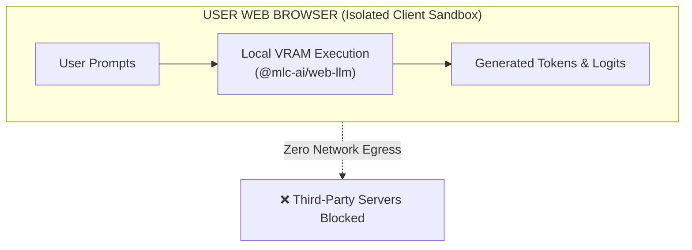

# Compliance, AI Safety & Data Privacy

This guide documents the licensing compliances, safety attributions, and data privacy structures implemented within The Token Cosmos.

---

## 1. Open-Source Software (OSS) Attributions

The Token Cosmos incorporates third-party open-source libraries. Licensing compliance details are maintained as follows:

| Library / Module | License Type | Purpose | Attribution Link |
| :--- | :---: | :--- | :--- |
| **React** | MIT | Core UI component lifecycle | [React License](https://github.com/facebook/react/blob/main/LICENSE) |
| **Vite** | MIT | Build system and dev proxy | [Vite License](https://github.com/vitejs/vite/blob/main/LICENSE) |
| **FastAPI** | MIT | REST API Gateway endpoints | [FastAPI License](https://github.com/fastapi/fastapi/blob/master/LICENSE) |
| **@mlc-ai/web-llm** | Apache 2.0 | Local WebGPU model inference engine | [WebLLM License](https://github.com/mlc-ai/web-llm/blob/main/LICENSE) |
| **Tailwind CSS** | MIT | Utility-first layout styles | [Tailwind License](https://github.com/tailwindlabs/tailwindcss/blob/master/LICENSE) |
| **Three.js** | MIT | WebGL semantic terrain rendering | [ThreeJS License](https://github.com/mrdoob/three.js/blob/dev/LICENSE) |

---

## 2. LLM Model Licensing & Usage Rights

The Token Cosmos supports execution of several pre-trained open weights LLMs. Developers and operators must adhere to individual model license terms:

- **SmolLM2 (135M)**: Released by Hugging Face under the **Apache 2.0 License**. It allows commercial modification, distribution, and private use without royalties.
- **Qwen2.5 (0.5B / 1.5B)**: Developed by Alibaba Cloud. Released under the **Apache 2.0 License** (or the Qwen License depending on the specific model size download). Commercial use is permitted up to specific active user limits. Refer to the [Qwen2.5 License Agreement](https://github.com/QwenLM/Qwen2.5/blob/main/LICENSE) for full details.

---

## 3. Enterprise Data Privacy Statement

Enterprise security audits require assurance that proprietary prompts (source code, contract agreements, customer data) are not leaked to external servers.

### Data Isolation Guarantees
- **WebGPU Local Mode**: When you load a model (like SmolLM2) via WebGPU, the model weights are retrieved from Hugging Face caches once and saved in your browser's local Cache storage. All token evaluations, prompts, and context calculations run **locally in your device's VRAM**. No text, logs, or metrics are sent over the network to external APIs.
- **Backend API Mode**: When running in Backend API mode, requests are sent to the API endpoint (`POST /api/logits`). This endpoint is hosted on **your private, containerized GCP Cloud Run instance**. The request is processed entirely in the container's memory space and is never logged or forwarded to external third parties.
- **Tracking & Analytics**: The Token Cosmos contains **zero analytics trackers, cookies, or remote reporting mechanisms**.
