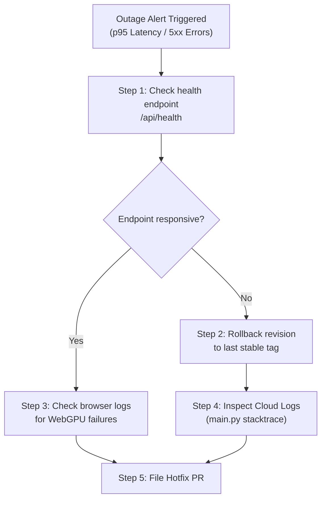

# Disaster Recovery & Rollback Playbook

This document details the emergency operations playbook for restoring service in the event of an outage or bad production deployment.

---

## 1. Zero-Downtime Rollback Process

If a newly deployed container image introduces bugs, memory leaks, or crashes on start, the team can roll back the changes to the last known stable deployment in under 10 seconds.

### Method A: Command-Line Rollback (Recommended)
You can instantly route all traffic back to a previous revision.

1. List the existing revisions of the service to find the last working revision name:
   ```bash
   gcloud run revisions list \
     --service=the-token-cosmos \
     --region=us-central1
   ```
2. Route 100% of user traffic to the stable revision (e.g., `the-token-cosmos-00042-abc`):
   ```bash
   gcloud run services update-traffic the-token-cosmos \
     --to-revisions=the-token-cosmos-00042-abc=100 \
     --region=us-central1
   ```

### Method B: Google Cloud Console Rollback
1. Navigate to the **Cloud Run console** and click on `the-token-cosmos`.
2. Select the **Revisions** tab.
3. Click **Manage Traffic**.
4. Set the traffic allocation of the last stable revision to `100%` and the broken revision to `0%`.
5. Click **Save**. Traffic will shift instantaneously without dropping active connections.

---

## 2. Database Downtime & Resilience

Many applications suffer catastrophic failures when their relational databases (PostgreSQL, MySQL) fail or experience high latency. 

```
            RESILIENT STATELESS FALLBACK METAPHOR
            
   ┌───────────────────────────────────────────────────────┐
   │                  CLIENT REQUEST                       │
   └───────────────────────────────────────────────────────┘
                               |
                               v
   ┌───────────────────────────────────────────────────────┐
   │             CHECK GGUF MODEL / ENGINE                 │
   └───────────────────────────────────────────────────────┘
            |                               |
    (Model Loaded)                  (Model Fails/Missing)
            v                               v
   ┌─────────────────┐             ┌───────────────────────┐
   │ Llama.cpp Engine│             │ Synthetic Fallback    │
   │  Returns Logits │             │   (Always Online)     │
   └─────────────────┘             └───────────────────────┘
```

The Token Cosmos mitigates database issues via its **stateless architectural design**:
- **No Transactional Database**: The system operates without an attached database, making it immune to connection pool saturation, deadlocks, and data loss.
- **Model Engine Fallback**: If the local GGUF model file (e.g., Qwen) is missing, fails to load, or becomes corrupted, the backend FastAPI server catches the error and falls back to the **Synthetic Logit Generator Engine** automatically. The API returns prompt-aware, deterministic logits immediately, maintaining application availability.

---

## 3. Incident Response Playbook

Follow these steps when responding to an active outage:



1. **Verify Outage**: Attempt to curl the health endpoint: `curl -I https://the-token-cosmos.run.app/api/health`.
2. **Shift Traffic**: If the health check fails or returns an error, execute a rollback to the last stable revision using Method A or B.
3. **Analyze Stacktrace**: Check the Google Cloud Log Explorer to view the FastAPI logs and identify the bug.
4. **Local Reproduction**: Rebuild the image locally using the Docker command:
   ```bash
   docker build -t the-token-cosmos-test .
   docker run -p 8080:8080 the-token-cosmos-test
   ```
5. **Publish Hotfix**: Push the fix to `main` to trigger the automated CI/CD pipeline.
