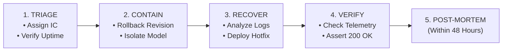

# Incident Response Plan (IRP)

This playbook establishes the operational protocol for identifying, containing, resolving, and auditing production incidents for **The Token Cosmos**.

---

## 1. Incident Classification Tiers

Incidents are classified into three severity tiers to allocate engineering resources appropriately:

| Severity | Description | Criteria | Response SLA |
| :--- | :--- | :--- | :--- |
| **Sev1 (Critical)** | Core outage | - Healthcheck `/api/health` unresponsive.<br>- Production container failing to start.<br>- Client-side WebGPU/WASM crashes exceeding 10% of active sessions. | **< 15 minutes** (PagerDuty alert triggered) |
| **Sev2 (Major)** | Degradation | - Token generation latency exceeds 200ms/token.<br>- WebGPU fallback rate exceeds 20% of sessions. | **< 4 hours** (Slack notification triggered) |
| **Sev3 (Minor)** | Minor issue | - Visual canvas glitches.<br>- Slider/UI responsiveness problems not impacting inference. | Next business day |

---

## 2. Operational Response Phases (Sev1 Protocol)

When a Sev1 incident is triggered by PagerDuty alerts, the team enters the following incident lifecycle:



### Phase A: Triage & Identification
1. **Incident Commander (IC)**: The on-call engineer who acknowledges the PagerDuty alert automatically assumes the role of **Incident Commander**.
2. **Responsibilities**: The IC owns communications, coordinates the debugging resources, and decides when to trigger containment rollbacks.
3. **Verify API Uptime**: Run a quick validation check:
   ```bash
   curl -I https://the-token-cosmos.run.app/api/health
   ```

### Phase B: Containment
The primary objective of containment is to restore application availability as fast as possible, even before the root cause is resolved:
- **Cloud Run Rollback**: If the backend API container is throwing exceptions or failing to start, execute an immediate traffic shift to the last known stable revision:
  ```bash
  gcloud run services update-traffic the-token-cosmos \
    --to-revisions=the-token-cosmos-v4-0-stable=100
  ```
- **Feature Flag Bypass**: If a specific model tier (e.g. Qwen 1.5B) is failing on client GPUs, the IC can disable the model choice in the config registry or push a quick layout override.

### Phase C: Eradication & Recovery
Once the production system is stabilized:
1. **Log Analysis**: Search Google Cloud Logs Explorer using queries targeting exception stack traces:
   ```sql
   resource.type="cloud_run_revision"
   severity>=ERROR
   ```
2. **Local Reproduction**: Replicate the bug locally using the Docker runtime:
   ```bash
   docker build -t cosmos-hotfix .
   docker run -p 8080:8080 cosmos-hotfix
   ```
3. **Hotfix Deployment**: Push the correction to the `main` branch. The automated CI/CD pipeline will execute Bandit, Gitleaks, Trivy, and unit tests before building the release.

### Phase D: Post-Incident Verification
- **Uptime Monitoring**: Verify that `/api/health` returns `200 OK`.
- **Telemetry Check**: Monitor the BigQuery telemetry tables to verify that the generation speeds have returned to baseline targets (average tokens/sec > 25).

---

## 3. Blameless Post-Mortem Mandate

For every Sev1 incident, the Incident Commander is responsible for coordinating a **Blameless Post-Mortem** within **48 hours** of incident resolution.

### Requirements:
- **No Blame**: Focus on system weaknesses rather than human mistakes.
- **Artifact Generation**: Author an incident report document stored under `docs/post_mortems/` named `YYYY-MM-DD-incident-description.md`.
- **Contents**: Include:
  - Timeline of events (first alert to resolution).
  - Root cause analysis (Five Whys).
  - Remediation actions (short-term hotfix and long-term preventive engineering items with assigned owners).
