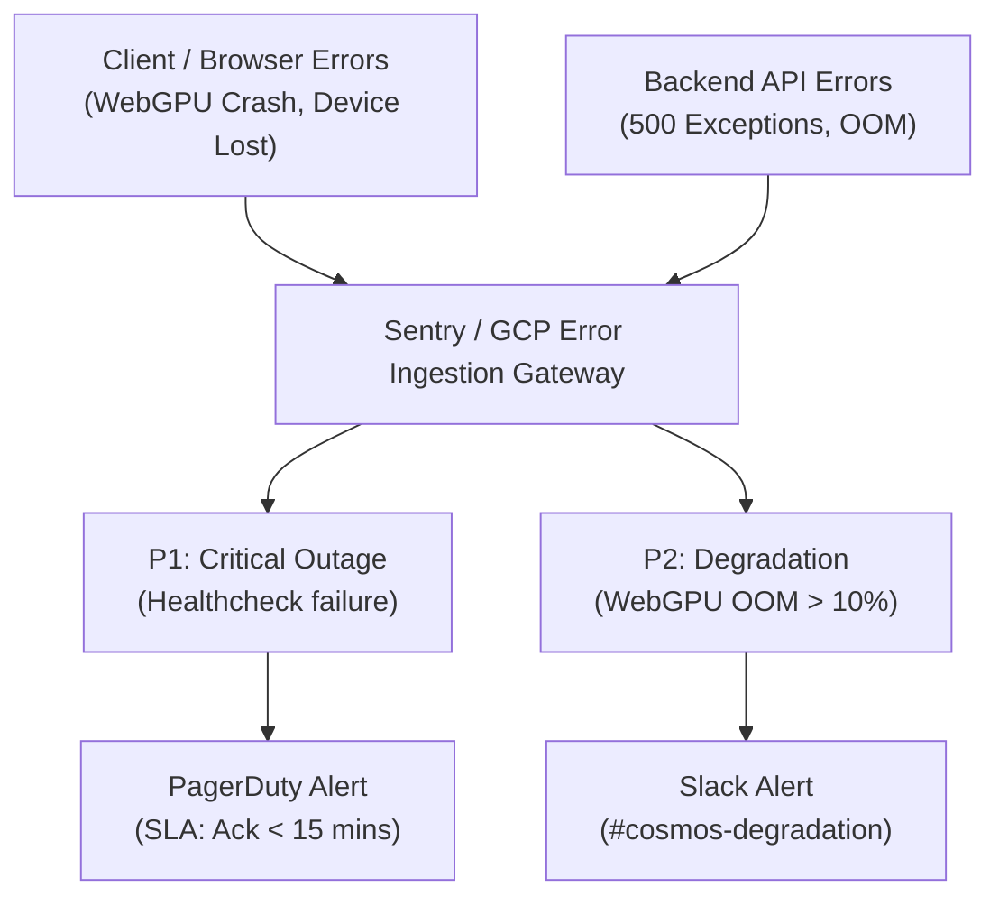

# Monitoring & Observability

The Token Cosmos combines cloud-side telemetry for its API gateway with client-side console reporting for its edge-AI WebGPU execution. This dual monitoring strategy ensures maximum visibility into user experiences and system stability.

---

## 1. Cloud-Side Telemetry (FastAPI & Cloud Run)

All production request logs are routed through **Google Cloud Logging**. Monitoring dashboards are set up in the Google Cloud Console.

### Production Dashboards
- **Google Cloud Run Dashboard**: Displays instance count, request volume, CPU/memory utilization, latency percentiles (p50, p95, p99), and container errors.
- **Log Explorer Query**: Inspects runtime Python errors and HTTP request codes.
  ```sql
  resource.type="cloud_run_revision"
  resource.labels.service_name="the-token-cosmos"
  severity>=ERROR
  ```

### Key Server Metrics & Alerting Thresholds

| Metric | Target | Warning Threshold | Alert Threshold (Critical) | Mitigation Action |
| :--- | :--- | :--- | :--- | :--- |
| **Instance CPU Load** | <60% | >80% for 5 mins | >90% for 2 mins | Autoscale container count; check for infinite loops in Python regex filters. |
| **Memory Utilization** | <50% | >75% of limit | >90% of limit | Restart container instances; check for memory leaks in llama.cpp model references. |
| **API Response Latency** | <80ms | >200ms | >500ms (Synthetic logits) | Investigate endpoint processing times or CPU throttle on cold starts. |
| **HTTP Error Rate** | <0.1% | >1% | >3% (5xx status) | Roll back immediately to the previous container image tag. |

---

## 2. Client-Side Telemetry (Edge WebGPU / WASM)

Because the heavy LLM weights run directly inside the user's browser, server-side monitoring cannot capture WebGPU runtime failures. We instrument client-side errors to detect performance degradation.

### Key Telemetry Indicators
- **VRAM Allocation**: Monitored via the WebGPU worker during initialization.
  - *SmolLM2 135M*: Allocates ~180MB.
  - *Qwen2.5 0.5B*: Allocates ~500MB.
  - *Qwen2.5 1.5B*: Allocates ~1.2GB.
- **Token Generation Speed**: Measured as millisecond latency per generated token (ms/token).
- **WebGPU Support Rate**: Percentage of client sessions where WebGPU is successfully initialized vs. falling back to WASM or the Backend API.

### Browser Telemetry Metrics & Critical Limits

| Event / Metric | Normal Range | Alert Limit (Console Logged) | Action Triggered |
| :--- | :--- | :--- | :--- |
| **WebGPU OOM Error** | N/A | Triggered upon GPU allocation failure | Instantly falls back to WASM or Synthetic API mode; prompts user to reduce model size. |
| **Generation Latency** | <50ms per token | >150ms per token | Suggest standard/light model tier; reduce input context window. |
| **WebGPU Init Timeout** | <5 seconds | >15 seconds | Force-unload model worker thread; restart WebWorker instance. |

---

## 3. Health & Status Checks

The API exposes a healthcheck endpoint that verifies the engine status:

- **Endpoint**: `GET /api/health`
- **Response Format**:
  ```json
  {
    "status": "online",
    "app": "The Token Cosmos API",
    "engine": "llama-cpp" // or "synthetic-cosmos-engine"
  }
  ```
The uptime monitor (e.g. Google Cloud Monitoring Uptime Check) polls `/api/health` every 60 seconds to assert a `200 OK` status.

---

## 4. Production Error Aggregation & Alert Routing

To ensure client-side WebGPU failures or backend uncaught exceptions do not go unnoticed, The Token Cosmos implements an automated runtime error tracking and alert dispatching flow.



### 1. Client & Server Error Aggregation
- **Client-Side Exception Capture**: Sentry is initialized in the React client and the `WebGPUInferenceWorker.ts`. It intercepts unhandled runtime exceptions and WebGPU device lost events (`device.lost`). Every client-side event payload is enriched with:
  - User-Agent details (OS, Browser version).
  - WebGPU Adapter metadata (vendor name, device architecture, driver version if available).
  - Selected model tier during the crash.
- **Server-Side Exception Capture**: Unhandled HTTP 500 exceptions, database timeout conditions, or startup faults in FastAPI are intercepted by the Sentry middleware and GCP Error Reporting.

### 2. Alert Escalation & Routing Rules
Alerts are classified based on severity to prevent alert fatigue:

- **P1: Critical Outages**
  - *Triggers*: `/api/health` uptime checks fail for 2 consecutive cycles, or unhandled exception volume exceeds 10 per minute.
  - *Escalation Route*: Pushed directly to **PagerDuty** for immediate pager notifications.
  - *Response SLA*: On-call engineer must acknowledge within **15 minutes**. Unacknowledged alerts automatically escalate to the secondary manager pool after 10 minutes.
- **P2: Performance Degradation**
  - *Triggers*: WebGPU initialization failure or forced WASM/Synthetic mode fallback exceeds 10% of active sessions in a 5-minute window.
  - *Escalation Route*: Posted to the `#cosmos-degradation` Slack channel.
  - *Response SLA*: Checked and addressed during standard business hours (next business day).

