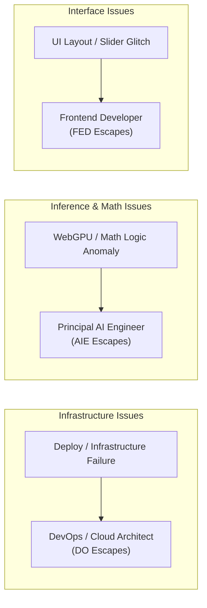

# Component Ownership (RACI Matrix)

To ensure operational excellence and clear communication across the team, this matrix defines ownership roles for all modules and pipelines in The Token Cosmos.

---

## 1. Role Definitions

- **Responsible (R)**: The role that actually performs the development, coding, and maintenance of the component.
- **Accountable (A)**: The role with ultimate ownership, signing off on release changes, security compliance, and budget.
- **Consulted (C)**: The subject matter experts whose input, feedback, or review is sought before major changes are made.
- **Informed (I)**: The stakeholders who are kept up-to-date on changes, progress, or operational failures, but are not directly involved in implementation.

### Key Team Members / Roles
1. **Founder / Product Owner (PO)**: Directs the business roadmap, economic strategy, and design aesthetic guidelines.
2. **Principal AI / WebGL Engineer (AIE)**: Manages mathematical sampling models, WebGPU integrations, canvas rendering, and performance bottlenecks.
3. **Frontend Developer (FED)**: Core React components, layout, state, responsive styling, and client-side page routing.
4. **DevOps / Cloud Architect (DO)**: Manages GCP Cloud Run infrastructure, OIDC authentication, docker build strategies, and CI/CD pipelines.

---

## 2. RACI Matrix

| System Component | Description | Founder / PO | AI Engineer (AIE) | Frontend (FED) | DevOps (DO) |
| :--- | :--- | :---: | :---: | :---: | :---: |
| **Frontend UI & Layout** | Core React interface, TelemetryBar, CosmicGuide, and styling | **A** | **C** | **R** | **I** |
| **Edge Inference Engine** | `WebGPUInferenceWorker.ts` and use of `@mlc-ai/web-llm` | **I** | **R / A** | **C** | **I** |
| **2D Starfield Canvas** | `TokenCosmosGraph.tsx` rendering active token stars | **A** | **R** | **C** | **I** |
| **3D Terrain Canvas** | `TerrainCanvas.tsx` & pre-computed UMAP binary file loading | **A** | **R** | **C** | **I** |
| **Sampling Math Engine** | Client-side math formulas in `samplingMath.ts` | **I** | **R / A** | **C** | **I** |
| **Backend REST API** | FastAPI routing and request validators in `backend/main.py` | **I** | **C** | **R** | **A** |
| **Local GGUF Models** | Llama.cpp Python wrappers and GGUF model path mountings | **I** | **R** | **I** | **A** |
| **Production Dockerfiles** | Unified multi-stage container build and package management | **I** | **C** | **C** | **R / A** |
| **CI/CD Pipeline** | GitHub Actions workflows and Workload Identity configuration | **I** | **I** | **I** | **R / A** |
| **Documentation Suite** | `/docs` markdown files, MkDocs config, and API generator | **A** | **R** | **R** | **R** |

---

## 3. Operational Escalation Path

When issues arise in production or during deployment, follow this escalation protocol:

- **Build/Deployment Failures**: Direct immediately to **DevOps (DO)**.
- **WebGPU Out-of-Memory / Canvas crashes**: Direct to **Principal AI Engineer (AIE)**.
- **UI glitches, CSS/Tailwind misalignments**: Direct to **Frontend Developer (FED)**.
- **API service outages**: DevOps and AI Engineer collaborate on service logs.
