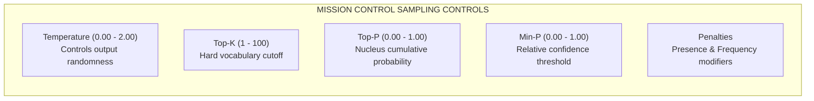
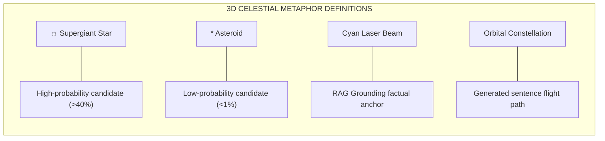

# End-User Interface Manual

This manual provides an operational guide for end-users, product managers, and analysts on how to navigate and use **The Token Cosmos** graphical user interface.

---

## 1. Mission Control: Adjusting LLM Sampling Parameters

The sidebar panel, **Mission Control**, allows you to customize the mathematical filters that dictate how the model chooses the next token.

### Parameter Explanations & Practical Advice

- **Temperature ($T$)**: Controls the randomness of the model's output.
  - *Setting to $\le 0.1$*: Generates extremely deterministic, predictable text (Greedy sampling). Useful for coding and structured data.
  - *Setting to $0.7 - 0.9$*: Standard balance of creativity and coherence.
  - *Setting to $> 1.2$*: Increases creativity and randomness. High temperatures can lead to grammatical breakdown and hallucination.
- **Top-K**: Caps the number of candidate tokens to evaluate.
  - *Example*: Setting Top-K to 50 means only the 50 highest probability tokens are considered for selection, and the other 49,000+ vocabulary tokens are discarded.
- **Top-P (Nucleus)**: Discards candidate tokens dynamically based on their cumulative probability.
  - *Example*: Setting Top-P to 0.90 keeps the smallest subset of tokens whose summed probabilities equal or exceed 90%. If the model is confident in 2 tokens, only those 2 are kept; if it is confused, 100 tokens might be kept.
- **Min-P (Relative Thresholding)**: Filters out tokens whose probability is lower than a percentage of the highest token's probability.
  - *Example*: Setting Min-P to 0.05 and if the top token has a probability of 60% ($0.60$), any token with a probability below $0.05 \times 0.60 = 3\%$ ($0.03$) is discarded. Min-P is highly recommended over Top-P because it preserves vocabulary diversity when the model is uncertain, yet truncates noise when the model is confident.
- **Penalties**:
  - *Presence Penalty*: Deducts a flat score from a token's logit if it has already appeared in the generated text. Prevents repetition.
  - *Frequency Penalty*: Deducts a score proportional to the absolute count of a token's occurrences. Forces the model to use wider vocabulary.

---

## 2. Interpreting the 3D Particle Starfield & Semantic Terrain

The main viewport renders vocabulary tokens as celestial bodies mapping the model's inner thoughts.

### Navigating the Viewports
- **2D Starfield Graph**: Displays the immediate logit distribution. Top candidates are central, large glowing supergiant stars; low-probability candidates are outer asteroids.
- **3D Semantic Terrain**: Projects the full vocabulary using UMAP coordinates (X/Y axes) and token probabilities (Z-axis height).
  - *Semantic Clustering*: Related tokens cluster together (e.g. numbers in one sector, verbs in another).
  - *Height Elevation*: The taller the peak (Z-axis), the more likely the token is to be selected.

> [!CAUTION]
> **Additive Blending Illusion**: When looking directly top-down at the 3D Terrain, dense clusters of dim stars overlap and appear bright due to transparency blending. Rotate the camera horizontally to inspect the actual Z-axis height profiles of individual peaks.

---

## 3. Keyboard Shortcuts & UI Controls

Maximize your interface efficiency with these interactive hotkeys:

| Action / Control | Trigger Method | Description |
| :--- | :--- | :--- |
| **Play / Pause** | Spacebar (Canvas focus) | Pause token generation to inspect logits at a specific step, or resume. |
| **Zen Mode** | Double-Click Canvas / Zen Button | Hides the control sidebars, giving you a full-screen visualization of the constellation flight path. |
| **Camera Reset** | `R` Key / Reset Button | Returns the 3D camera to its default orbital position. |
| **Toggle Engine** | Settings Modal | Switch between Local WebGPU inference (running on your device) and Cloud Run API fallback. |

---

## 4. UI Troubleshooting Q&A

### Q: The output is stuck repeating the exact same word in a loop. How do I fix it?
- **Solution**: The Temperature is likely too low, or you need to apply penalties. Open Mission Control and increase **Presence Penalty** to `0.5`, **Frequency Penalty** to `0.5`, and raise the **Temperature** to `0.8`.

### Q: The UI reports "WebGPU Unavailable — falling back".
- **Solution**: Check that you are running a supported browser (Chrome 113+ or Safari 18+). If you are using a virtual machine or a computer without a dedicated GPU, click the engine gear icon and select **Cloud Run API Mode** to run logits on the server.

### Q: Spacebar is not pausing the text generation.
- **Solution**: Ensure your mouse focus is on the 3D canvas itself. Click once anywhere on the starfield background and try pressing the spacebar again.
